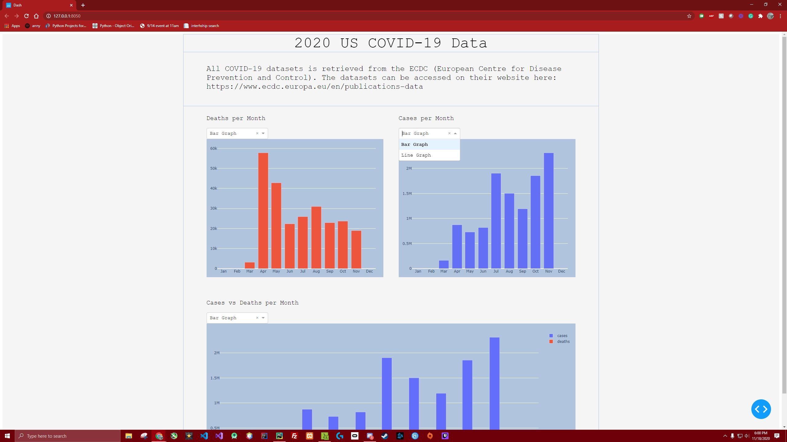

# Covid19-Web-Scraper
Graphing COVID19 data using the pandas, plotly, and dash libraries and web scraping the data from the European Centre for Disease Prevention and Control.

Deployed on Heroku here: https://covid19dashapp.herokuapp.com/

